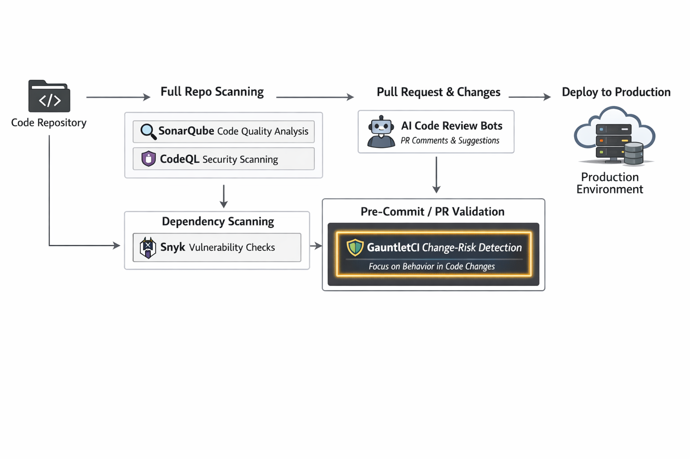

# Compare GauntletCI to Other Code Analysis Tools

> **🤝 A Note on Comparisons**
>
> GauntletCI does not aim to replace any of the tools listed below. Each serves a distinct purpose. This page exists to help you understand where GauntletCI fits in your existing toolchain—not to convince you to abandon tools you already trust.

---

## 🧭 Where GauntletCI Fits

GauntletCI sits between static analysis and runtime behavior.

- Static analysis tools check code quality and known patterns
- Security tools detect vulnerabilities
- AI tools provide suggestions
- GauntletCI focuses on **change-risk detection** in pull requests

It answers a question other tools do not:

> What did this change break that we are not testing?

---

GauntletCI operates in the code analysis ecosystem, but it focuses on a different problem than traditional static analysis, security scanners, or AI code review tools.

**GauntletCI is a diff-aware analysis tool that performs pull request risk detection by identifying behavior changes that are not properly validated by tests or safeguards.**

Most tools answer:
- "Is this code good?"
- "Is this code secure?"
- "Does this match known bad patterns?"

GauntletCI answers a different question:

> ⚠️ Did this pull request introduce behavior that is not properly validated?

---

## ⚔️ GauntletCI vs SonarQube

SonarQube is excellent at what it does. If you need broad language support, historical trend analysis, and enterprise reporting, it's the correct choice. GauntletCI is not a replacement—it's a specialized layer for .NET teams who are still seeing unexplained production incidents despite clean SonarQube reports. We call this the "Coverage Mirage." SonarQube says the code is clean. GauntletCI asks if it survives the runtime.

GauntletCI and SonarQube are both used during development, but they solve fundamentally different problems.

SonarQube analyzes the entire codebase for code quality issues, bugs, and maintainability concerns.

GauntletCI analyzes only the changes in a pull request and focuses on whether those changes introduce risky or under-tested behavior.

### 🔍 Core Difference

- SonarQube = full codebase static analysis
- GauntletCI = diff-aware change-risk detection

SonarQube looks for known patterns across all code.  
GauntletCI evaluates what changed and asks whether those changes are properly validated.

### 📊 Capability Comparison

| Capability | GauntletCI | SonarQube |
|-----------|------------|-----------|
| Analyzes full codebase | No | Yes |
| Diff-aware analysis | Yes | No |
| Pull request risk detection | Yes | Limited |
| Detects under-tested changes | Yes | No |
| Static code quality rules | No | Yes |

### 🧭 When to Use Each

Use SonarQube if you want to enforce code quality standards and detect known issues across your entire codebase.

Use GauntletCI if you want to detect risky changes in pull requests before they are merged.

### 🤝 Combined Use

These tools are complementary.

- SonarQube ensures overall code quality  
- GauntletCI ensures each change is behaviorally safe  

---

## ⚔️ GauntletCI vs CodeQL

CodeQL is a security researcher's dream. It's unmatched for variant analysis across an entire codebase. But it's not designed to answer: "This PR looks fine. Will it deadlock under load?" GauntletCI is the behavioral stress test for what changed today. In a mature DevSecOps pipeline, they coexist: CodeQL scans for vulnerabilities; GauntletCI audits for runtime survivability.

GauntletCI and CodeQL operate in different layers of analysis.

CodeQL is a semantic code analysis engine designed to detect security vulnerabilities using query-based rules.

GauntletCI is focused on identifying behavior changes in pull requests that may not be properly tested or validated.

### 🔍 Core Difference

- CodeQL = security vulnerability detection
- GauntletCI = behavior change risk detection

CodeQL identifies known classes of vulnerabilities.  
GauntletCI identifies risky changes regardless of whether they match known vulnerability patterns.

### 📊 Capability Comparison

| Capability | GauntletCI | CodeQL |
|-----------|------------|--------|
| Security vulnerability detection | No | Yes |
| Diff-aware analysis | Yes | Partial |
| Behavior change detection | Yes | No |
| Query-based analysis | No | Yes |
| Focus on test coverage gaps | Yes | No |

### 🧭 When to Use Each

Use CodeQL to detect security vulnerabilities and enforce secure coding practices.

Use GauntletCI to detect risky behavioral changes in pull requests that may not be properly validated.

### 🤝 Combined Use

- CodeQL protects against known vulnerabilities  
- GauntletCI protects against risky changes in behavior  

---

## ⚔️ GauntletCI vs Snyk Code

> **📋 Real-World Case Study**
>
> Snyk tells you your `Newtonsoft.Json` has a CVE. GauntletCI tells you your new caching logic will leak memory because you forgot an expiration policy.
>
> **Both are critical. Neither replaces the other.**
>
> If you're already using Snyk and still getting paged at 2 AM for "unexplained" .NET failures, that's the gap GauntletCI fills.

GauntletCI and Snyk Code both run during development, but they focus on different risk domains.

Snyk Code is a static application security testing (SAST) tool that identifies vulnerabilities in code.

GauntletCI focuses on whether code changes introduce behavior that is not properly tested or validated.

### 🔍 Core Difference

- Snyk Code = security and vulnerability scanning
- GauntletCI = change-risk detection in pull requests

Snyk Code detects insecure patterns.  
GauntletCI detects risky changes in logic and behavior.

### 📊 Capability Comparison

| Capability | GauntletCI | Snyk Code |
|-----------|------------|-----------|
| Security scanning | No | Yes |
| Diff-aware analysis | Yes | Partial |
| Behavior risk detection | Yes | No |
| Detects under-tested changes | Yes | No |
| Developer security feedback | No | Yes |

### 🧭 When to Use Each

Use Snyk Code to identify and fix security vulnerabilities early.

Use GauntletCI to detect risky behavior changes before they are merged.

### 🤝 Combined Use

- Snyk Code secures your code  
- GauntletCI ensures your changes are safe  

---

## ⚔️ GauntletCI vs AI Code Review Tools

AI code reviewers are like having an extra set of eyes. AI tools provide heuristic feedback and can surface useful suggestions, but they are non-deterministic and may produce inconsistent results across runs. GauntletCI is deterministic infrastructure. It doesn't get tired, doesn't hallucinate, and doesn't change its mind. The ideal workflow: the AI suggests, "Maybe extract this method." GauntletCI says, "Hard stop. This `async void` will crash the process. Fix it before merge."

AI code review tools use large language models to provide suggestions on code quality, readability, and potential issues.

GauntletCI takes a different approach by using deterministic rules to detect behavioral risk in code changes.

### 🔍 Core Difference

- AI tools = heuristic and suggestion-based
- GauntletCI = deterministic change-risk detection

AI tools provide broad feedback.  
GauntletCI provides targeted detection of risky changes.

### 📊 Capability Comparison

| Capability | GauntletCI | AI Code Review Tools |
|-----------|------------|----------------------|
| Deterministic analysis | Yes | No |
| Diff-aware behavior detection | Yes | Partial |
| Suggestions and style feedback | No | Yes |
| Detects under-tested changes | Yes | Limited |
| Consistent rule-based output | Yes | No |

### 🧭 When to Use Each

Use AI code review tools for general feedback, readability improvements, and developer guidance.

Use GauntletCI when you need reliable detection of risky behavior changes in pull requests.

### 🤝 Combined Use

- AI tools improve code quality and readability  
- GauntletCI ensures behavioral safety  

---

## 🔎 Tools Similar to GauntletCI

GauntletCI operates in a space adjacent to several established tools:

- SonarQube (code quality and static analysis)
- CodeQL (security-focused semantic analysis)
- Snyk Code (SAST and vulnerability detection)
- AI code review tools (LLM-based feedback)

While these tools overlap in the development workflow, they are not direct replacements.

GauntletCI is specifically focused on:

- diff-aware analysis  
- pull request risk detection  
- detecting under-tested behavior changes  
- identifying validation gaps in code changes  

---

## 🧠 Summary

Most tools analyze code.

GauntletCI analyzes change.

That difference is what allows it to detect a class of problems that traditional tools often miss:

> ⚠️ behavior introduced in a pull request that is not properly validated before merge

---

## 🕯️ The Bottom Line

If your security scanner is green, your linter is happy, and your AI says the code looks "clean," but you're still worried about what happens when this hits production at 2 AM—that's why we built GauntletCI.

Fewer 2 AM calls. Fewer quiet walks to the parking lot. Fewer unthought assumptions.

---

> **📐 Visualizing the Pipeline**
>
> 