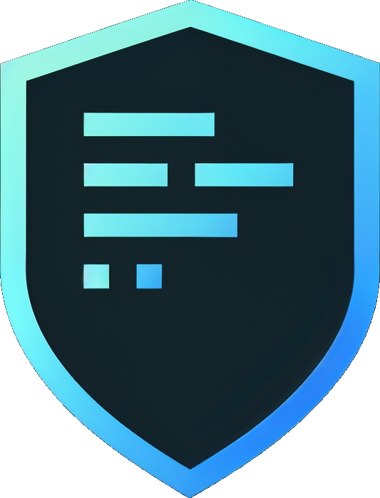

[](https://github.com/EricCogen/GauntletCI/commits/main)
[](https://github.com/EricCogen/GauntletCI/stargazers)
[](LICENSE)

<div></div>

# GauntletCI - Pre-commit change-risk detection for pull request diffs

**GauntletCI** is a .NET CLI tool that analyzes pull request diffs or as a pre-commit audit that detects **behavioral change-risk before code is merged**.

It answers one question:

> Did this change introduce behavior that is not properly validated?

---

## 📖 Why This Exists

Even experienced developers miss things in diffs.

Not because they lack skill — but because diffs are deceptive.

A small change can silently alter behavior:

- A new null check changes execution flow
- A guard clause introduces new exceptions
- A method signature changes without test updates
- A dependency call is modified without validation
- A conditional branch shifts logic in subtle ways

These are not syntax errors.  
They are **behavior changes** — and they regularly slip through code review.

GauntletCI exists to catch them **before they reach production**.

Read the full [story](STORY.md) behind GauntletCI.

---

## 🧠 Philosophy & Principles

GauntletCI is built on a clear set of principles defined in the **[GauntletCI Charter](CHARTER.md)**:

- **Coverage is Not Correctness** — Tests prove execution, not survival.
- **Falsification Over Verification** — We seek to disprove safety, not confirm compliance.
- **Intent is Material Context** — We cross-reference PR diffs with linked issues to detect semantic drift.
- **Privacy is Absolute** — All reasoning happens locally; no code ever leaves your machine.
- **Determinism Anchors Intelligence** — The local AI *explains*; deterministic Roslyn rules *enforce*.

---

## 🔍 What GauntletCI is (and is not)

### ✅ What it is
- Diff-aware change-risk detector
- Pre-commit / pre-merge safety layer
- Focused on behavior, not style
- **Intent-aware** — Cross-references implementation with linked issues (GitHub/Jira)

### ❌ What it is not
- Not a linter
- Not a test runner
- Not a static analysis replacement
- Not a code formatter

GauntletCI complements your existing tools; it does not replace them.

---

## 🚀 What it does

- Analyzes only **what changed** in a diff
- Detects **unvalidated behavior changes**
- Flags **missing or weak test coverage**
- Identifies **execution flow changes** (guards, exceptions, branching)
- Surfaces **API and contract changes**
- **Intent Alignment:** Compares PR diff with linked GitHub Issue to detect when the implementation drifts from the stated goal.
- Outputs actionable findings with file paths and line numbers

---

## 📦 Installation

```bash
dotnet tool install -g GauntletCI
```

---

## ⚡ Quick Start

```bash
# Analyze staged changes before committing
gauntletci analyze --staged

# Analyze a pull request diff file
gauntletci analyze --diff pr.diff

# Analyze a specific commit
gauntletci analyze --commit abc1234

# Export audit history as CSV
gauntletci audit export --format csv --output report.csv

# Expose GauntletCI to an AI assistant via MCP
gauntletci mcp serve
```

---

## 🛠 Commands

### `gauntletci analyze` — Analyze a diff

```bash
# Analyze staged changes
gauntletci analyze --staged

# Analyze a diff file
gauntletci analyze --diff pr.diff

# Analyze a specific commit
gauntletci analyze --commit abc1234

# Output as JSON
gauntletci analyze --staged --output json

# Emit GitHub Actions annotations
gauntletci analyze --staged --github-annotations
```

### `gauntletci audit` — Local audit trail

Every scan is automatically logged to `~/.gauntletci/audit-log.ndjson`.

```bash
# Export full audit log as JSON
gauntletci audit export

# Export as CSV
gauntletci audit export --format csv --output report.csv

# Filter to last 30 scans
gauntletci audit export --last 30

# Filter by date
gauntletci audit export --since 2025-01-01

# Quick summary stats
gauntletci audit stats
```

### `gauntletci mcp serve` — AI assistant integration (MCP)

GauntletCI exposes itself as a [Model Context Protocol](https://modelcontextprotocol.io/) server. Any MCP-compatible AI assistant (Claude Desktop, Cursor, Copilot, Windsurf) can call GauntletCI tools mid-conversation.

```bash
gauntletci mcp serve
```

**Claude Desktop config** (`~/.claude/claude_desktop_config.json`):

```json
{
  "mcpServers": {
    "gauntletci": {
      "command": "gauntletci",
      "args": ["mcp", "serve"]
    }
  }
}
```

**Available MCP tools:**

| Tool | Description |
|------|-------------|
| `analyze_staged` | Analyze staged git changes |
| `analyze_diff` | Analyze a raw diff string |
| `analyze_commit` | Analyze a specific commit |
| `list_rules` | List all 42+ analysis rules |
| `audit_stats` | Aggregate stats from local audit log |

### Other commands

- `gauntletci init` — Initialize GauntletCI config in your repo
- `gauntletci ignore` — Manage the ignore list
- `gauntletci postmortem` — Run postmortem analysis
- `gauntletci feedback` — Submit feedback on a finding
- `gauntletci telemetry` — Manage telemetry opt-in/out

---

## 📏 Rules

GauntletCI ships **42 built-in rules** (GCI0001–GCI0042) covering:

- Behavioral change detection and goal alignment
- Security risk, PII logging, authorization coverage
- Test coverage and test quality gaps
- Async safety, resource lifecycle, disposable resource management
- Data schema compatibility, idempotency/retry safety
- Observability, structured logging, rollback safety
- Architecture layer discipline and dependency injection safety

See [`docs/rules.md`](docs/rules.md) for the full rule catalogue.

---

## ⚙️ Configuration

Run `gauntletci init` to generate a `.gauntletci.json` config file in your repository root. You can use it to:

- Enable or disable specific rules
- Set confidence thresholds
- Configure ignore patterns

---

## 🔒 Privacy

All analysis is **local**. No code ever leaves your machine.

- Telemetry is **opt-in** and anonymous (no code, no file paths, no content)
- All findings are stored only in `~/.gauntletci/audit-log.ndjson`

See the [GauntletCI Charter](CHARTER.md) for the full privacy commitment.

---

## 📄 License

[Elastic License 2.0](LICENSE)
