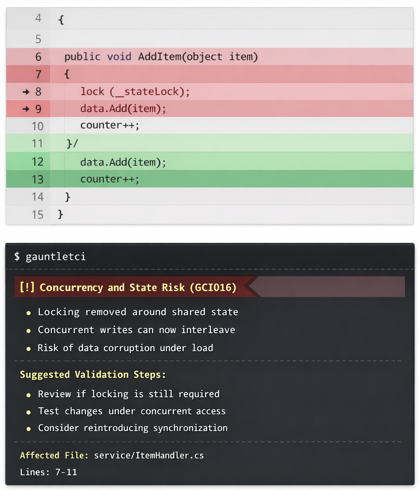

# GauntletCI

[](https://github.com/EricCogen/GauntletCI/actions/workflows/ci.yml)
[](https://www.nuget.org/packages/GauntletCI)
[](LICENSE)

Pre-commit change-risk detection for pull requests.

---

## The idea in one sentence

> You changed what the code does.  
> Nothing proves it still works.

---

## What GauntletCI does

GauntletCI evaluates your diff before it lands and answers one question:

**Did this change introduce behavior that is not properly validated?**

---

## Why this exists

Code review checks intent.  
Tests check correctness.  

Neither answers:

**Did this change introduce behavior that is not properly validated?**

Most production issues are not caused by syntax errors.

They are caused by small changes that looked safe and were not fully validated.

---

## A real example (what this feels like)

A small diff removes locking.

Code gets simpler. Nothing else changes.

Now concurrent requests can corrupt shared state.



This is the class of problem GauntletCI surfaces.

---

## More examples

### Looks equivalent, changes runtime behavior

Async code becomes blocking. Error handling is simplified.

It still works. It still compiles.

But behavior under load and failure conditions is no longer the same.

---

### Tests pass, production gets slower

Cached data is replaced with per-request IO.

Tests pass. Output is correct.

Latency, throughput, and cost degrade in production.

---

## Where this fits

Most tools focus on:

- Code correctness (tests)
- Code quality (linters, static analysis)
- Code suggestions (AI review tools)

GauntletCI focuses on something different:

> Behavioral risk introduced by a change.

---

## The difference

Most tools analyze code.

GauntletCI analyzes **what changed**.

- Tests verify expected outcomes  
- Linters enforce rules  
- Static analysis inspects code structure  
- AI review tools suggest improvements  

GauntletCI highlights where behavior may have changed without sufficient validation.

---

## What it returns

- evidence-backed findings  
- affected files and locations  
- why the change matters  
- suggested validation actions  

---

## Model usage

The model is used to:

- interpret diffs in context  
- reason about behavioral impact  
- explain why a change may be risky  
- suggest validation steps  

It does not generate code.

It is a reasoning layer on top of deterministic rule detection.

---

## What this is

A diff-first system that surfaces behavior changes that are likely not fully validated.

It does not try to prove correctness.

It highlights uncertainty.

---

## What this is not

Not a linter  
Not static analysis  
Not code generation  

Does not replace code review or tests

---

## Docs

- [Change Risk Thesis](./docs/change-risk-thesis.md)  
- [Change Risk Research](./docs/change-risk-research.md)

---

## Installation

dotnet tool install -g GauntletCI

---

## Quickstart

GauntletCI needs minimal configuration to understand:

- how to run your tests  
- which rules should block a commit  
- which model (remote or local) to use for analysis  

Works with local models for offline or cost-controlled usage.

1. Create or edit `.gauntletci.json`:

```json
{
  "test_command": "dotnet test",
  "disabled_rules": [],
  "blocking_rules": ["GCI012", "GCI004"],
  "model_required": false,
  "telemetry": true,
  "model": "claude-sonnet-4-6"
}